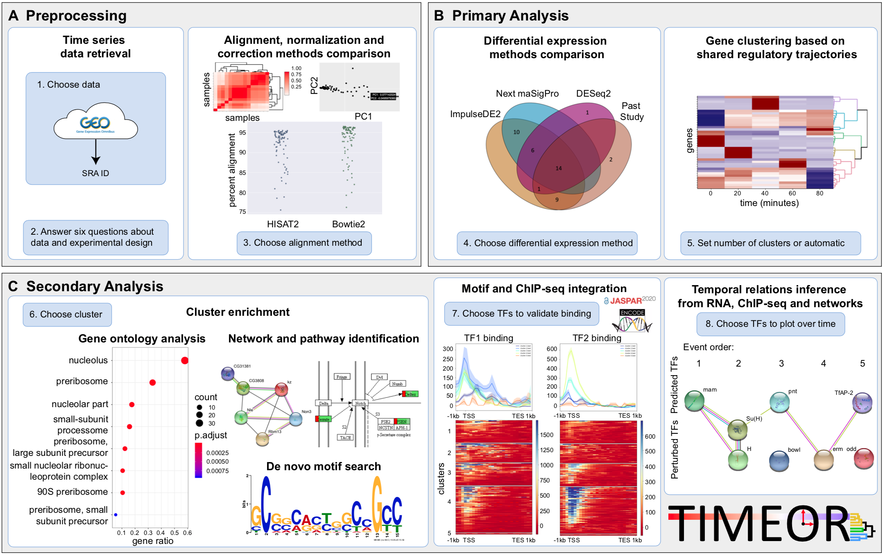

Overview
========

The [TIMEOR software (web and Docker)](https://github.com/ashleymaeconard/TIMEOR) gives users a flexible and intuitive web platform with which to
upload their time-series RNA-seq data and protein-DNA data, and step through the entire temporal differential gene
expression and gene dynamics analysis pipeline to generate a transcription factor gene regulatory network that is user guided. The application is organized into three
separate stages: Pre-processing, Primary Analysis, and Secondary Analysis. [Click here](https://www.youtube.com/watch?v=bBodWvGPD6g&t=8s) for a quick video demonstration of the TIMEOR webserver, and [click here](https://www.youtube.com/watch?v=-BV9B3L1ymg) for a video guide through the webserver tutorial (next tab). Note that there have been recent additions to TIMEOR to make the experience flow more efficiently. While these videos do not reflect these additions, yet the steps and process are still the very same. Enjoy!

 

 

A.  ***Pre-processing*: Gather and configure time series RNA-seq data**.
    The user can choose to process raw data (.fastq files) using a GEO
    identifier, or upload a raw count matrix (genes by samples). TIMEOR
    then automatically chooses from several methods with which to
    perform quality control, alignment, and produce a count matrix. The
    user can then choose between several methods to normalize and
    correct the data.

B.  ***Primary Analysis*: Use methods to perform differential gene
    expression analysis and determine gene trajectory clusters**. TIMEOR
    provides two continuous and one categorical DE method for the user.
    Specifically, DE genes are determined using one or more of
    [ImpulseDE2](https://bioconductor.org/packages/release/bioc/html/ImpulseDE2.html),
    [Next
    maSigPro](https://www.bioconductor.org/packages/release/bioc/html/maSigPro.html)
    and/or
    [DESeq2](http://bioconductor.org/packages/release/bioc/html/DESeq2.html),
    depending on your answers to questions in the Pre-processing stage.
    The user can then compare (via Venn diagram) the DE results between
    methods with a previous study of their choice to determine which DE
    method results to use for downstream analysis. The user can toggle
    between methods to determine which results produce the most
    resonable results to pass on to the next Secondary Analysis. TIMEOR
    then automatically clusters and creates an interactive clustermap of
    the selected DE gene trajectories over time. The user can choose a
    different number of clusters if desired.

C.  ***Secondary Analysis*: Assess enrichment, factor binding, and
    temporal relations**. The user can analyze the gene trajectory
    clusters using three categories of analysis in different tabs:
    *Enrichment*, identifies the genes and gene types that are
    over-represented within each cluster; *Factor Binding*, predicts which
    TFs are post-transcriptionally influencing the expression of each
    gene cluster using motif and ChIP-seq data; and *Temporal Relations*,
    identifies transcription factor (TF) gene regulatory network (GRN).  **Blue arrow:** predicted TF to observed TF, experimentally determined interaction.  **Pink arrow:** observed TF to observed TF, experimentally determined interaction.  **Yellow arrow:** observed TF to observed TF, predicted interaction.  **Green arrow:** predicted TF to observed TF, predicted interaction. Network displayed in table format in app to enhance flexibility of GRN visualization.

Paper and Citation
=======

Please join a number of labs already using TIMEOR. [Read our paper here](https://www.biorxiv.org/content/10.1101/2020.09.14.296418v1), and cite:

Conard, A. M., Goodman, N., Hu, Y., Perrimon, N., Singh, R., Lawrence, C., & Larschan, E. (2020). TIMEOR: a web-based tool to uncover temporal regulatory mechanisms from multi-omics data. bioRxiv.

Contact
=======
**Github**: https://github.com/ashleymaeconard/TIMEOR

**Email**: ashley_conard[at]brown[dot]edu

