Quick Start: 3 Steps
=======
 TIMEOR accepts 2 input types: (1) raw .fastq files and SraRunTable [(e.g. here)](https://github.com/ashleymaeconard/TIMEOR/blob/master/demos/real_data_subset/timeor/data/SraRunTable.csv) or a (2) RNA-seq time-series read count matrix [(e.g. here)](https://github.com/ashleymaeconard/TIMEOR/blob/master/demos/simulated_data/timeor/data/countMatrix.csv) and metadata file [(e.g. here)](https://github.com/ashleymaeconard/TIMEOR/blob/master/demos/simulated_data/timeor/data/metadata.csv).

1. Visit https://timeor.brown.edu.
2. For (1) in 'Example Data' (side-bar) under 'Load raw data' click the 'SraRunTable & .fastq files' button. This will guide you through the 'Set Input and Defaults, Process Raw Data' tab demo. **Follow pop-ups and fill in grey boxes**. See [Run TIMEOR](#run-timeor-from-raw-data-starting-from-.fastq-time-series-rna-seq) below for walk-through.
3. Next, for (2) in 'Example Data' (side-bar) under 'Load count matrix' click the 'Metadata & read count file' button. This will guide you through the rest of the full method demo. **Follow pop-ups and fill in grey boxes**. See [Run TIMEOR](#run-timeor-using-simulated-data-starting-from-read-count-matrix) below for full application walk-through.

Website
=======

### Computational Biology Core at Brown Univeristy and DRSC/TRiP Functional Genomics Resources at Harvard Medical School Partnership
TIMEOR is available online at https://timeor.brown.edu.

Run TIMEOR
===================

## Two ways to input data:

1.   Import **SraRunTable from GEO**\* where TIMEOR will process raw data
    through retrieving .fastq files, quality control, alignment, and
    read count matrix creation. Read first tab of TIMEOR (Getting Started) for information about 
    this input specification. Read [this section](https://timeor.brown.edu/app_direct/timeor/timeor_app_tutorial.html#run-timeor-from-raw-data-starting-from-.fastq-time-series-rna-seq) for information about how to process these data in TIMEOR. **We strongly encourage users to upload a read count matrix**, or process raw .fastq data via TIMEOR's interface locally using Docker ([see 5 steps here](#local-installation)).

2.   Import **metadata file\*\* and count matrix \*\*\*** (skipping raw
    data retrieval, quality control, alignment, and read count matrix
    creation) and proceeding straight to normalization and correction. Read first tab of TIMEOR (Getting Started) for information about this input specification. Read [this section](https://timeor.brown.edu/app_direct/timeor/timeor_app_tutorial.html#run-timeor-using-simulated-data-starting-from-read-count-matrix) for information about how to process these data in TIMEOR.

Then simply follow the prompts. Fill out the **grey** boxes to begin
interacting with each stage and tab. 

#### Input file types:

      NOTE: see first tab of TIMEOR called Getting Started for specifications.

  - \* **SraRunTable from GEO** requires at least these columns (which will be reordered to produce the metadata file).
    - *treatment, time, Run, replicate, batch*
        - *treatment*: one word describing experiment
        - *time*: numerical values e.g. (0, 20, 40)
        - *replicate*: one word description of replicate

  - \*\* **metadata file** requires *at least* these columns.
    -   *ID, condition, time, replicate*
        -   *ID*: a unique identifier (ID) for the user
            (e.g. case1min\_rep1)
        -   *condition*: one word description (e.g. case, control)
        -   *time*: numerical values e.g. (0, 20, 40)
        -   *replicate*: one word description of replicate (e.g. b1, b2, b3)

  - \*\*\* **count matrix**  requires Ensembl or Flybase unique gene identifiers, and columns should be the IDs from metadata file, and in the same order as metadata file.

Getting Started with TIMEOR 
=======

Please read through this first page of information to help guide you through TIMEOR.

     

     

     

     

Importantly, before beginning the analysis, TIMEOR requires the user to give data details to set the adaptive default methods used downstream. The 'Getting Started' Tab above under section 'Suggestions for How to Answer Six 'Determine Adaptive Default Methods' Questions' [(here)](https://timeor.brown.edu/app_direct/timeor/timeor_getting_started.html#suggestions-for-how-to-answer-six-determine-adaptive-default-methods-questions) provides suggestions for how to answer these. 

**NOTE:** We **stronly recommend** keeping 'Yes' as the answer for Question 5 to compare multiple methods, as this highlights valuable TIMEOR functionality.

     

     

## Run TIMEOR from Raw Data: Starting from .fastq Time-Series RNA-seq
This tutorial uses a subset of real data used in the TIMEOR publication to
take the user through TIMEOR's "Process Raw Data" tab. You will first see this pop-up. Please read.
There are 4 steps.

**NOTE**: When possible we advise the user to start from a read count matrix, as our file size limit is 10GB. For larger datasets, the user can use TIMEOR locally (still through web interface) via Docker, by following the 5 steps [below, and here](#local-installation).

1.  In the far-left side-bar click on “Example Data” and then
    under “Load raw data” click on "SraRunTable & raw .fastq files". This will load the answers to the adaptive default questions (left) and also load input details (right). 

     

     

2.  Follow the pop-up prompt to explore the default settings to questions 1-6 to set the adaptive 
    default parameters, and then click the "Run" button to begin retrieving the raw data (SRR8843738
    and SRR8843750), performing quality control, and aligning the reads using HISAT2 and Bowtie2.

     

     

     

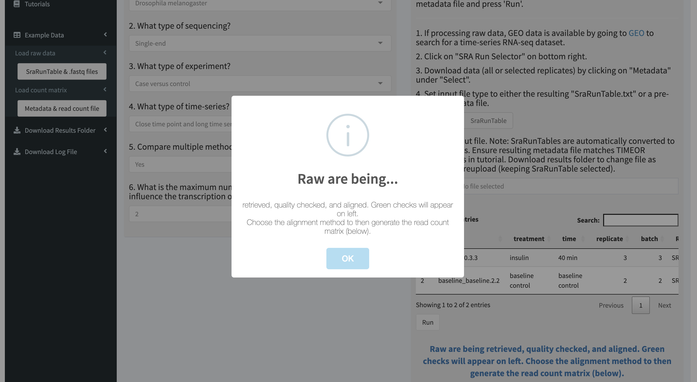

     

3.  Once the data have been retrieved and quality control has finished. You can view a summary under
    the "Quality Control" panel on the right. Interactive results can be downloaded and viewed from MultiQC.

     

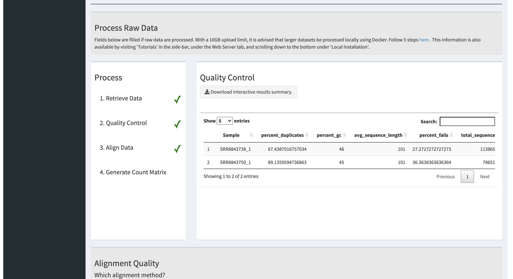

     

 

     

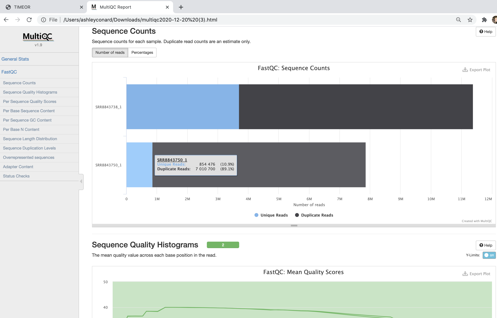

     

   

4.  You can explore the alignment results between both methods in the "Alignment Quality" panel. Note that
    HISAT2 is splice-site aware). You can choose the method and then click "Generate count matrix" to have 
    TIMEOR generate the read count matrix for the next tab "Load Count Matrix". You will see a green check mark when finished. Follow pop-up. You have completed this section of the tutorial for loading raw time-series RNA-seq data.

     

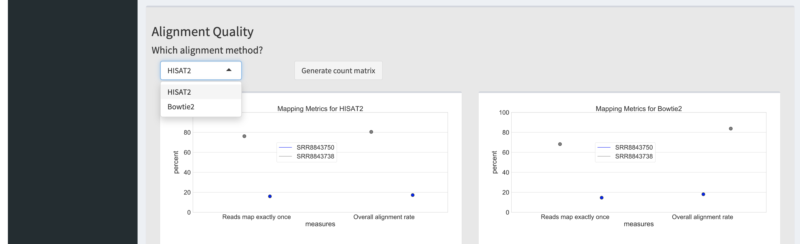

     

 

     

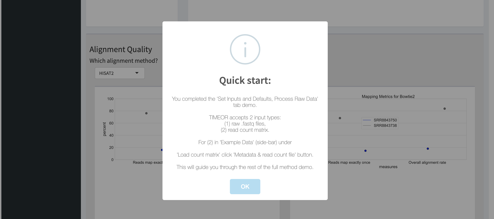

     

 

## Run TIMEOR Using Simulated Data: Starting from Read Count Matrix

This tutorial uses simulaated data and takes the user through TIMEOR’s full
functionality beginning from a read count matrix (genes x sample/time). **NOTE**: figures with two panels are the same page,
just split. There are 20 steps.

**The user can begin this tutorial before *or* after following ["Run TIMEOR from Raw Data: Starting from .fastq Time-Series RNA-seq"](#run-timeor-from-raw-data-starting-from-.fastq-time-series-rna-seq).**

1.  In the far-left side-bar click on “Example Data” and then
    under “Load simulated data” click on "Metadata & read count file".

2.  Follow the pop-up to explore results on the Pre-processing
    tabs "Process Raw Data" and "Process Count Matrix".

 

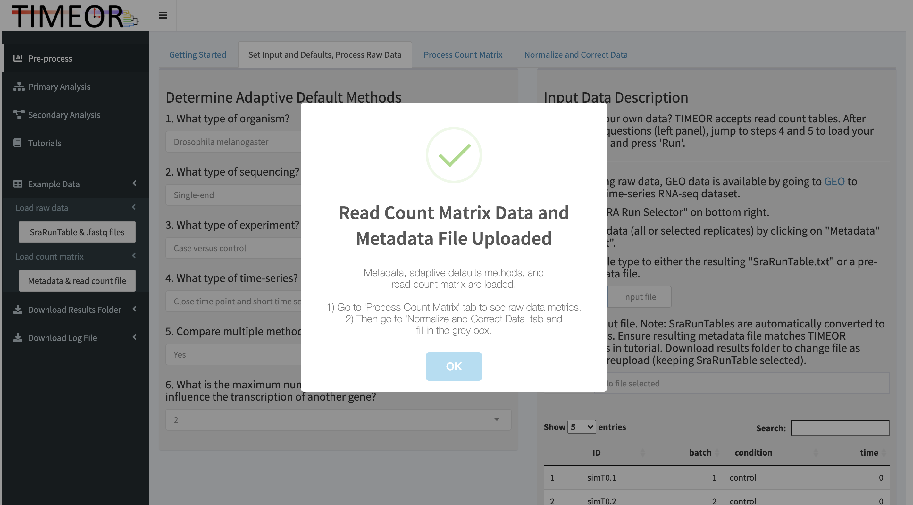

 

 

 

 

 

3.  On the Normalize and Correct Data tab, choose from normalization and
    correction methods and click “Run” to view result. Visit the 'Method and Question Choice Assistance' section of the 'Getting Started' tab ([here](https://timeor.brown.edu/app_direct/timeor/timeor_getting_started.html##method-and-question-choice-assistance)) for suggestions on how to choose the appropriate normalization and correlation settings. You have completed pre-processing. Follow pop-up.

 

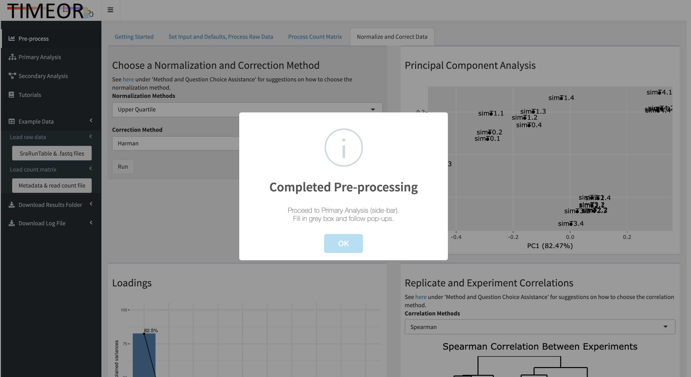

 

 

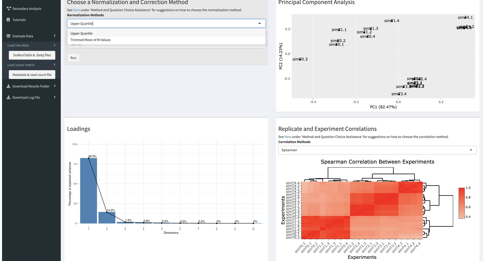

 

4.  Proceed to Primary Analysis and click “Run”.

5.  At the bottom right you will see a pop-up to click “Render
    Venn Diagram” in the top right to compare differential expression
    results between three methods (ImpulseDE2, Next maSigPro, and
    DESeq2) and choose which method results to proceed with. 
    You will then see a pop-up saying that you have completed Primary Analysis. 
    Feel free to move on with TIMEOR's default parameters, **or explore Primary Analysis options (see next step)**.

 

 

 

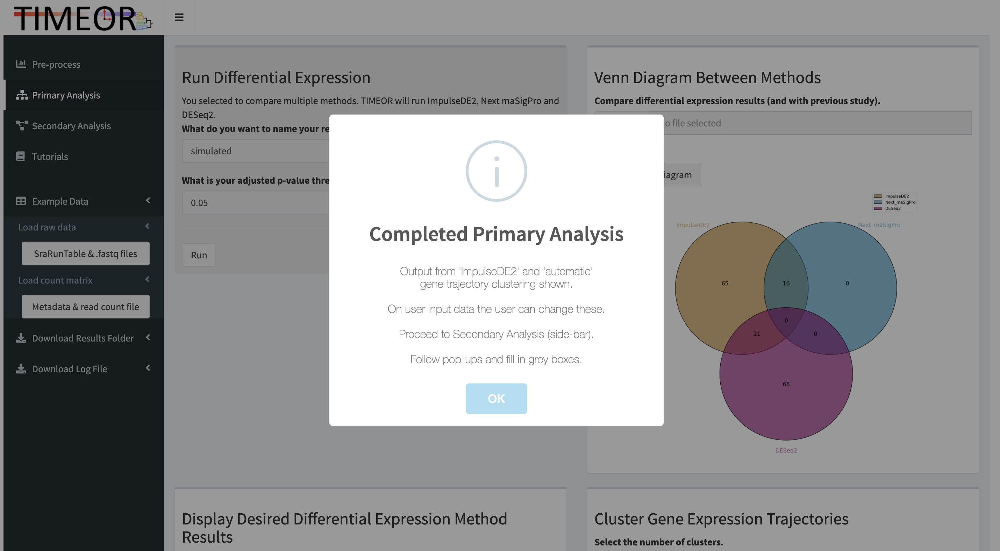

 

6.  See 3-way Venn diagram in white box. You can compare a previous study list of genes with the three differential expression
    results by first downloading [prev\_study.txt](https://github.com/ashleymaeconard/TIMEOR/blob/master/demos/simulated_data/timeor/data/prev_study.txt). Then upload this file using the Browse button. See 4-way Venn diagram in blue box. 

 

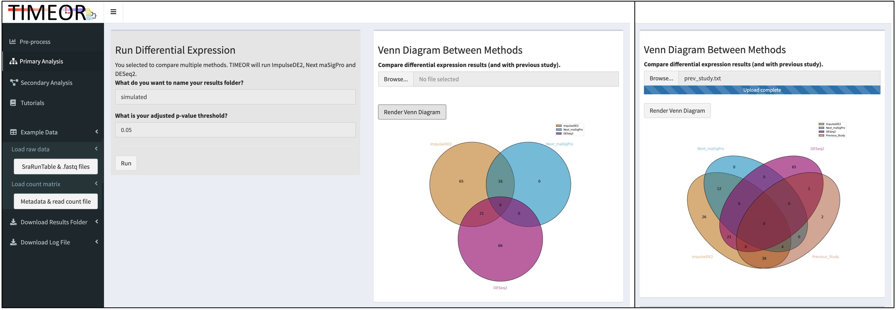

 

7.  Examine differential expression method results in the bottom row.
    Toggle under “Display Desired Differential Expression Method
    Results” between ImpulseDE2, Next maSigPro, and DESeq2 on the left,
    and the interactive clustermap with automated clustering will
    display the differentially expressed gene trajectories for the
    chosen method. TIMEOR provides an automatic clustering option (shown) which takes the mode between three unsupervised clustering methods (partition around medoids, Silhouette, and Calinski criterion) to automatically return the number of gene trajectory clusters to the user. PDF available on download to see clustering plots. You can then also toggle “Cluster Gene Expression Trajectories” to choose the
    number of clusters desired. For this demonstration, we chose "ImpulseDE2" differentially expressed gene output. We also chose "automatic" clustering of gene trajectories. On new data the user can choose these two parameters.
    **NOTE:** ImpulseDE2 is chosen because
    it has the largest differential expressed gene overlap with the
    previous study and other methods.

 

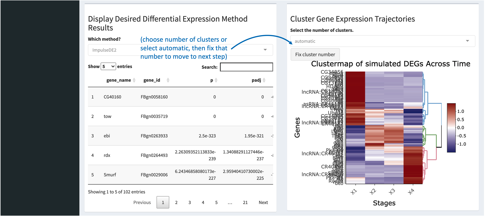

 

8. As said in pop-up, proceed to Secondary Analysis tab in side-bar.

9. Clusters are labeled in ascending order from 1 for top-most cluster. Under Gene Expression Trajectory Clusters choose cluster 1, 2, or 3
    in the dropdown. On the right under “Chosen Cluster Gene Set” you
    will see the genes in that cluster. **Genes are the same color as
    the gene trajectory cluster to which they belong**.

10. Once you have chosen which genes set to test for enrichment, click
    the “Analyze” toggle to “ON”.

11.  Wait to view any enriched gene ontology (GO) terms (Molecular
    Function, Biological Process, or Cellular Component), pathway,
    network, and/or motif analysis. **NOTE** you may download the
    interactive motif results for viewing.

12.  Toggle the “Analyze” button to “OFF” to choose another gene set, and
    repeat steps 9-12.

 

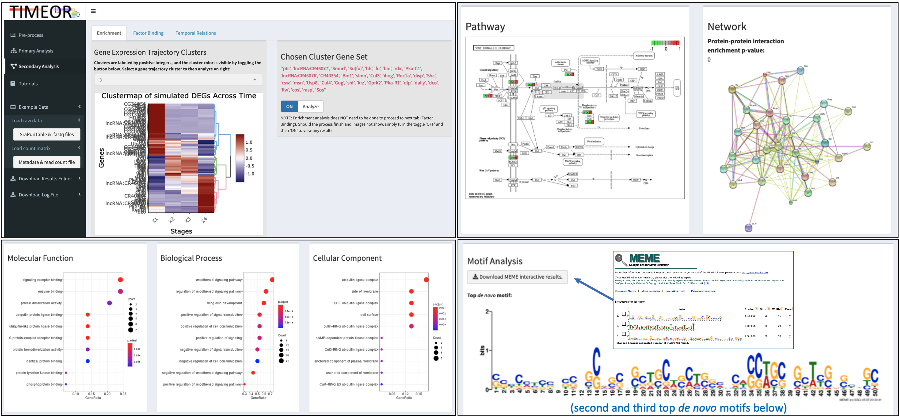

 

13. Proceed to the "Factor Binding" tab to view the *observed* (that is, differentially expressed genes in data) and top
    predicted transcription factors in each gene cluster (under
    “Observed and Top Predicted Transcription Factors”). At least 40% of the transcription factor prediction methods must agree on their top predicted transcription factors, otherwise cell is left blank. Row names are gene expression trajectory clusters. **NOTE** for this demonstration the threshold is reduced.
    

 

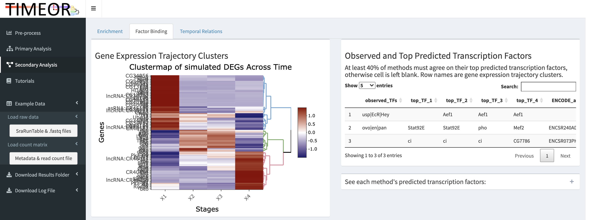

 

14.  In that same table on the far right you will see ENCODE IDs indicating
    published ChIP-seq data for the predicted transcription factors. For this tutorial, can either see an example provided with "pho". 
    You may also either download these read-depth normalized .bigWig files here ([ENCFF467OWR](https://github.com/ashleymaeconard/TIMEOR/blob/master/demos/simulated_data/timeor/data/ENCFF467OWR.bigWig), [ENCFF609FCZ](https://github.com/ashleymaeconard/TIMEOR/blob/master/demos/simulated_data/timeor/data/ENCFF609FCZ.bigWig), [ENCFF346CDA](https://github.com/ashleymaeconard/TIMEOR/blob/master/demos/simulated_data/timeor/data/ENCFF346CDA.bigWig)) or follow the prompts (step 16) in the grey box under “Upload
    .bigWig Files”. Any .bigWig files from protein-DNA data are accepted. 
    
15. If you are interested, click on the “+” under
    “See each method's predicted transcription factors:” to
    see the ranked lists of transcription factors and motifs by method.
    Blanks indicate an enriched motif is not assigned to a transcription factor region (to see motifs click 'Download interactive cluster motif result'). Search for a method (e.g. transfac in blue box), enrichment score, etc. Row names are top 1 - 4 transcription factors. 

 

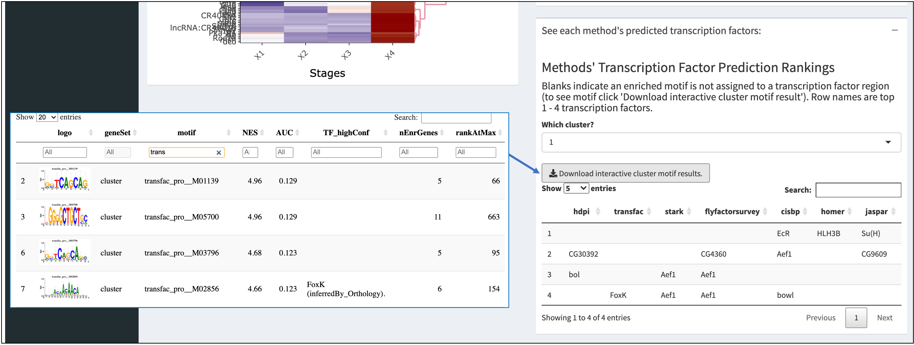

 

16.  Under “Average Profiles Across Each Gene Expression Trajectory
    Cluster”, in the second box type “stat92e”, upload
    ENCFF467OWR.bigWig, and click “Go”. In the third box type
    “CG7786”, upload ENCFF346CDA.bigWig, and click “Go”. You will see 3
    average profile distributions in each plot and a heatmap with 3 partitions (one for gene trajectory each cluster). 
    **NOTE** each color of the distribution matches the corresponding gene trajectory cluster.

 

 

17.  Proceed to the last tab to view the temporal relations between
    transcription factors. On the first row you are reminded of the
    observed and predicted transcription factors to bind each gene
    cluster. 
  

 

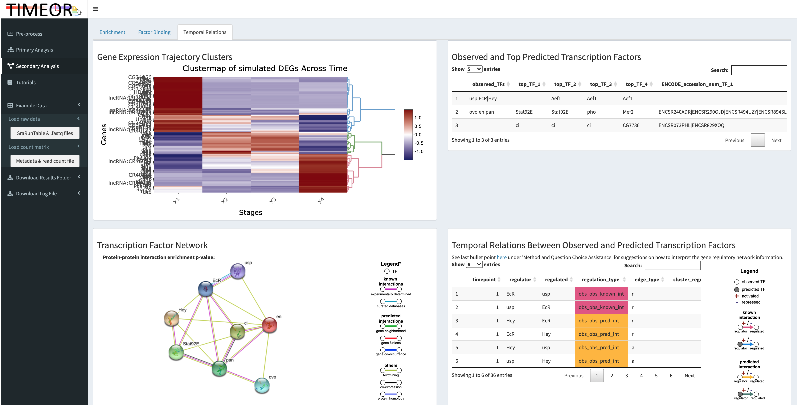

 

 

18. Specifically, zooming into the second row to the left you will see “Transcription
    Factor Network" of both obiserved and predicted transcription
    factors. On the right (”Temporal Relations Between Observed and
    Predicted Transcription Factors") you will see a table highlighting
    the temporal relations between transcription factors. **TIMEOR identified the transcription factor (TF) gene regulatory network (GRN).**
    These temporal relationships are identified and represented in the legend
    (far-right).  **Blue arrow/highlight:** predicted TF to observed TF, experimentally determined interaction.  **Pink arrow/highlight:** observed TF to observed TF, experimentally determined interaction.  **Yellow arrow/highlight:** observed TF to observed TF, predicted interaction.  **Green arrow/highlight:** predicted TF to observed TF, predicted interaction. Network displayed in table format in app to enhance flexibility of GRN visualization.

 

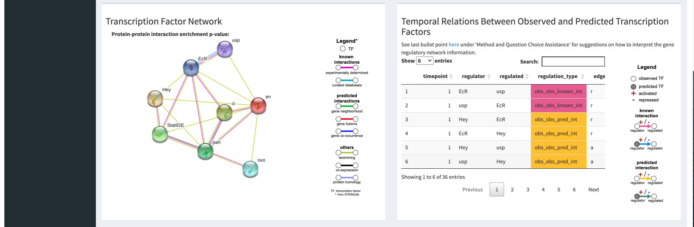

 

19.  On the third row (“Network Customization: move and add desired genes
    to describe temporal relation”) the user can use this information to
    create a customized network to temporally relate all transcription
    factors and other genes. Do so by clicking “Search” and then
    “Multiple proteins”.
    

 

 

20. Your results folder can be downloaded on the far-left side-bar under "Download Results Folder". **NOTE** The original simulated data and results can be downloaded [here](https://github.com/ashleymaeconard/TIMEOR/tree/master/demos/simulated_data). 

 

 

Local Installation 
=======

To run TIMEOR outside of website (recommended for preprocessing from raw .fastq files), users may use Docker and Docker Hub. First, the TIMEOR repository must be cloned (<a href="https://github.com/ashleymaeconard/TIMEOR.git" class="uri">https://github.com/ashleymaeconard/TIMEOR.git</a>). To use Docker, it must be installed (version 20.10.0 recommended).

### Docker Hub and Docker:

  1.	Download organism genome folder (genomes_info).
          * The user is welcome to gather only the organism of interest. For example, for Drosophila melanogaster simply download `/genomes_info/dme/`
              * Mouse is `/genomes_info/mmu/`
              * Human is `/genomes_info/hsa/`
          * Link `/genomes_info/`: https://drive.google.com/drive/folders/1KEnpCOU0dQU5p1tnEy3o9l02NE0uYnpm?usp=sharing
  2.	Choose directory location for genomes_info (e.g. `/Users/USERNAME/Desktop/test_folder/genomes_info/`)
  3.	Run TIMEOR via Docker
          * On command line type 
              * `$ docker pull ashleymaeconard/timeor:latest` 
              * `$ docker images`
              * `$ docker run -v /Users/USERNAME/Desktop/test_folder/:/src_copy -p 3838:3838 <IMAGE_ID>`
  4.	Add `/genomes_info/` folder to Docker container
          * In another command line window
              * `$ docker container ls`
              * `$ docker exec -it <CONTAINER_NAME> /bin/bash/`
              * `# chmod -R 777 /src_copy/genomes_info/`
              * `# mv /src_copy/genomes_info/ /srv/`
  5.	Open TIMEOR Application is available by typing: 
          * Shiny server will be running on port 3838. Thus, in a browser visit `localhost:3838`.
  
### Or, build Docker image 

NOTE: This could take a while. Please follow these commands:
  
  1.	`$ cd /PATH/TO/TIMEOR/`
  2.	Build Docker image in TIMEOR directory:
          * `$ docker build -t timeor_env .`
  3.	Follow instructions above from "3. Run TIMEOR via Docker"
  
Details
=======

### Real Data Subset in Tutorial

The original temporal RNA-seq data analyzed in our paper comes from Zirin et al., 2019). In this tutorial SRR8843750 and SRR8843738 are analyzed to demonstrate the "Process Raw Data" tab in which raw RNA-seq data are retrieved, quality checked, aligned (with HISAT2 and Bowtie2), and converted to a read count matrix. The real data subset folder (which TIMEOR automatically generates) can be downloaded [here](https://github.com/ashleymaeconard/TIMEOR/tree/master/demos/real_data_subset).

### Simulated Data in Tutorial

The original simulated data folder can be downloaded [here](https://github.com/ashleymaeconard/TIMEOR/tree/master/demos/simulated_data).

#### Secondary Analysis: Factor Binding

To get the top 4 TFs a 25% concensus threshold was used, with a
normalized enrichement score threshold of 3.

Command used:
`Rscript get_top_tfs.r /PATH/TO/simulated_results/ dme 3 4 25 /PATH/TO/TIMEOR/`

The following bigWig files were collected:

-   ENCFF467OWR (read-depth normalized signal between both replicates)
    within dataset ENCSR240ADR for Stat92E

-   ENCFF609FCZ (read-depth normalized signal between both replicates)
    within dataset ENCSR681YMA for pho

-   ENCFF346CDA (read-depth normalized signal between all three replicates)
    within dataset ENCSR776AVR for CG7786

### Real Data in Publication

The results presented in TIMEOR's publication can be downloaded in TIMEOR's automatically generated folders [here](https://github.com/ashleymaeconard/TIMEOR/tree/master/demos/real_data_full).
