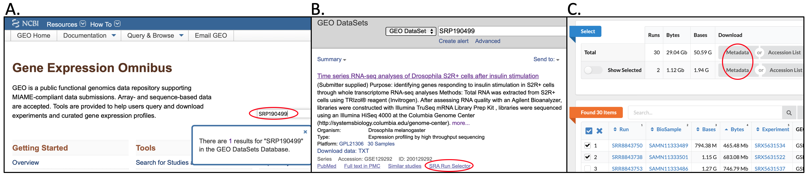
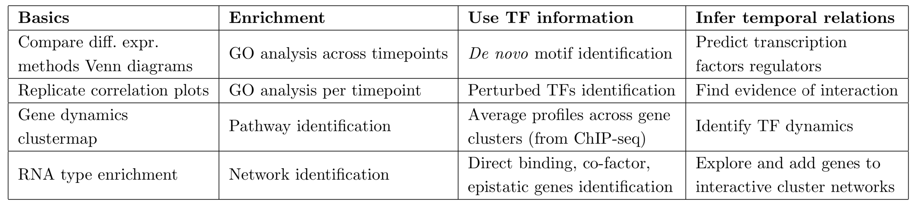

TIMEOR’s web-interface can be run online at https://timeor.brown.edu,
and through [Conda and Docker](https://github.com/ashleymaeconard/TIMEOR). TIMEOR can also be run at the command
line, which will be discussed in this tutorial, within the Conda
environment provided. To begin, we assume you are using the command line
and have Conda/miniconda 2 (version 4.8.2).

Installation
============

To run TIMEOR scripts individually, the users may use Docker and Docker Hub. First, the TIMEOR repository must be cloned (<a href="https://github.com/ashleymaeconard/TIMEOR.git" class="uri">https://github.com/ashleymaeconard/TIMEOR.git</a>). To use Docker, it must be installed (version 20.10.0 recommended).

### Docker Hub and Docker:

  1.	Download organism genome folder (genomes_info).
          * The user is welcome to gather only the organism of interest. For example, for Drosophila melanogaster simply download `/genomes_info/dme/`
              * Mouse is `/genomes_info/mmu/`
              * Human is `/genomes_info/hsa/`
          * Link `/genomes_info/`: https://drive.google.com/drive/folders/1KEnpCOU0dQU5p1tnEy3o9l02NE0uYnpm?usp=sharing
  2.	Choose directory location for genomes_info (e.g. `/Users/USERNAME/Desktop/test_folder/genomes_info/`)
  3.	Run TIMEOR via Docker
          * On command line type 
              * `$ docker pull ashleymaeconard/timeor:latest` 
              * `$ docker images`
              * `$ docker run -v /Users/USERNAME/Desktop/test_folder/:/src_copy -p 3838:3838 <IMAGE_ID>`
  4.	Add `/genomes_info/` folder to Docker container
          * In another command line window
              * `$ docker container ls`
              * `$ docker exec -it <CONTAINER_NAME> /bin/bash/`
              * `# chmod -R 777 /src_copy/genomes_info/`
              * `# mv /src_copy/genomes_info/ /srv/`
  
### Or, build Docker image 

NOTE: This could take a while. Please follow these commands:
  
  1.	`$ cd /PATH/TO/TIMEOR/`
  2.	Build Docker image in TIMEOR directory:
          * `$ docker build -t timeor_env .`
  3.	Follow instructions above from "3. Run TIMEOR via Docker"

Pre-processing
=========

Get raw .fastq time course RNA-seq
----------------------------------

If you have your own time course RNA-seq data, go to step 4.

1.  Go to [GEO](https://www.ncbi.nlm.nih.gov/geo/), search for a time
    course RNA-seq dataset (e.g. SRP190499, Figure 1A).
2.  Click on SRA Run Selector on bottom right (Figure 1B).
3.  Under Select click on “Metadata” to download, or select which
    replicates you desire to use, then click on that “Metadata” to
    download (Figure 1C).
4.  Place resulting SraRunTable.txt.csv in the directory of your
    choosing to access in the next step.

<figure>
<figcaption><strong>Figure 1</strong>. Example using GEO to load data into TIMEOR.</figcaption>
</figure>

We have chosen to download a couple raw sample .fastq files,
specifically SRR8843738 and SRR8843750. Follow these next steps to
process your data in the Load Stage, followed by Primary and Secondary
Analysis. We are going to place our TIMEOR example results in
`~/Desktop/test_timeor/`.

Process raw .fastq time course RNA-seq
--------------------------------------

### Parse GEO SraRunTable

TIMEOR parses `SraRunTable.txt.csv` into a `metadata.csv` file and
`SraAccList.csv`, and generates underlying directory structure. Simply
make sure there are at least 4 columns with the following substrings,
‘treatment’, ‘time’, ‘replicate’,‘run’, and ‘batch’. Note that the
generated ID will take the first full word in the column as part of the
identifier in the form: treatment\_time.replicate.batch. These terms are
not case senitive and do not have to be in any particular order.

**Parameters**:

    Usage: python parse_metadata.sh 
        1) /FULL/PATH/TO/DESIRED/OUTPUT_DIR/ 
        2) /FULL/PATH/TO/SraRunTable.txt.csv

**Command**:

`time python parse_metadata.py ~/Desktop/test_timeor_load/ ~/Downloads/SraRunTable.txt-2.csv`

**Outputs**:

`SRR8843738_1.fastq.gz` and `SRR8843750_1.fastq.gz` are placed in
`/FULL/PATH/TO/DESIRED/OUTPUT_DIR/timeor/data/fastq/SAMPLE_NAME/REPLICATE_NAME`
(e.g. `~/Desktop/test_timeor/timeor/data/fastq/insulin_40/SRR8843750/SRR8843750_1.fastq.gz`
).

<details>
<summary>Long output</summary>
<pre>
Creating metadata file and SRA accession list.
parse_metadata.py:65: FutureWarning: The signature of `Series.to_csv` was aligned to that of `DataFrame.to_csv`, and argument 'header' will change its default value from False to True: please pass an explicit value to suppress this warning.
  sraRunTable_df.Run.to_csv(DIR+"/timeor/data/SraAccList.csv", index=False)
('Saved metadata file and SRA accession list here:', '/Users/ashleymaeconard/Desktop/test_timeor_load//timeor/data/SraAccList.csv')
real    0m1.239s
user    0m0.511s
sys     0m0.342s
</pre>
</details>

################ 

`usr/bin/time -v /DIR/get_fastq_files.sh 2 /DIR/results/ /data/compbio/timeor/data/fastq/SraAccList.txt`

**Output**:

      Starting data download at 2019-09-27_17-13-57
      Academic tradition requires you to cite works you base your article on.
      When using programs that use GNU Parallel to process data for publication please cite:

      O. Tange (2011): GNU Parallel - The Command-Line Power Tool,
      ;login: The USENIX Magazine, February 2011:42-47.

      This helps funding further development; AND IT WON'T COST YOU A CENT.
      If you pay 10000 EUR you should feel free to use GNU Parallel without citing.

      To silence the citation notice: run 'parallel --citation'.

      0% 0:2=0s SRR5666328  Read 4194151 spots for SRR5666333
      Written 4194151 spots for SRR5666333
      50% 1:1=4s SRR5666328 Read 4294807 spots for SRR5666328
      Written 4294807 spots for SRR5666328
      100% 2:0=0s SRR5666328
      Finished data download at 2019-09-27_17-17-00

1.  Next we check the quality of the reads with FastQC. In terminal type
    the following command, which should finish in a couple seconds.

`/usr/bin/time -v /data/compbio/timeor/scripts/run_fastQC.sh /data/compbio/timeor/data/fastq/`  
`/data/compbio/timeor/results/fastQC/ 2`

**Output**: 

    Started analysis of SRR5666333_1.fastq.gz
    Approx 5% complete for SRR5666333_1.fastq.gz
    Approx 10% complete for SRR5666333_1.fastq.gz
    ...
    Started analysis of SRR5666328_1.fastq.gz
    ...
    Approx 90% complete for SRR5666328_1.fastq.gz
    Approx 95% complete for SRR5666328_1.fastq.gz

    real    0m46.591s
    user    1m41.653s
    sys     0m2.728s

7.5. Running MultiQC will give a summary file for all samples.

    multiqc ~/Desktop/simu/timeor/results/load/fastqc/ -o ~/Desktop/simu/timeor/results/load/fastqc/

    [INFO   ]         multiqc : This is MultiQC v1.8
    [INFO   ]         multiqc : Template    : default
    [WARNING]         multiqc : You are running MultiQC with Python 2.7.17
    [WARNING]         multiqc : Please upgrade! MultiQC will soon drop support for Python < 3.6
    [INFO   ]         multiqc : Searching   : /Users/ashleymaeconard/Desktop/simu/timeor/results/load/fastqc
    [INFO   ]          fastqc : Found 2 reports
    [INFO   ]         multiqc : Compressing plot data
    [INFO   ]         multiqc : Report      : ../../../Desktop/simu/timeor/results/load/fastqc/multiqc_report.html
    [INFO   ]         multiqc : Data        : ../../../Desktop/simu/timeor/results/load/fastqc/multiqc_data
    [INFO   ]         multiqc : MultiQC complete

1.  Let TIMEOR know what the files are, for example case and control. In
    terminal type the following commands:  

<!-- -->

    fastq_into_folders.py
    Usage: python fastq_into_folders.sh /FULL/PATH/TO/FASTQ_FILES/ /FULL/PATH/TO/METADATA.txt

    (timeor_env2) ashleymaeconard@amc:~/Documents/LL_labs/timeor-shiny-app-v1/scripts/load$ python fastq_into_folders.py ~/Desktop/test_timeor_load/timeor/data/fastq/ ~/Desktop/timeor_example/inputs/metadata.csv 
    time python fastq_into_folders.py ~/Desktop/test_timeor_load/timeor/data/fastq/ ~/Desktop/timeor_example/inputs/metadata.csv 
                        ID         Run  replicate    time         treatment  batch
    0         insulin_40.3  SRR8843750          3  40 min           insulin      1
    1  baseline_baseline.2  SRR8843738          2   0 min  baseline control      2
    Moved raw .fastq data into sample and replicate folders here:
    /Users/ashleymaeconard/Desktop/test_timeor_load/timeor/data/fastq/

    real    0m0.770s
    user    0m0.471s
    sys     0m0.220s

1.  Next we align the reads to the genome and create a read count table.
    In terminal type the following command.  

`usr/bin/time -v /data/compbio/timeor/scripts/run_HISAT2_HTSeq.sh /data/compbio/timeor/data/fastq/`  
`/data/compbio/timeor/results/ _1.fastq.gz 10 4 0 genom`  

**Output**:

    Processing .fastq files with HISAT2 on 4 processors, keeping _1.fastq.gz characters of each replicate name.
    Subdir: /data/compbio/timeor/data/fastq//case/
    Initiating single-end RNA-seq data processing.
    Getting unpaired .fastq for /data/compbio/timeor/data/fastq//case//SRR5666328_1.fastq.gz
    Adding SRR5666328_1.fastq.gz to run_HISAT2_HTSeq.txt script

    Subdir: /data/compbio/timeor/data/fastq//control/
    Initiating single-end RNA-seq data processing.
    Getting unpaired .fastq for /data/compbio/timeor/data/fastq//control//SRR5666333_1.fastq.gz
    Adding SRR5666333_1.fastq.gz to run_HISAT2_HTSeq.txt script
    ...
    [bam_sort_core] merging from 1 files and 1 in-memory blocks...
    100000 GFF lines processed.
    200000 GFF lines processed.
    100000 GFF lines processed
    ...

    real    0m0.290s
    user    0m0.027s
    sys     0m0.019s

All steps to 1) load data, 2) perform quality control, 3) align, 4)
produce count matrix can be performed with:

    usr/bin/time -v /data/compbio/timeor/scripts/timeor_load.sh 2 /data/compbio/timeor/data/fastq/
    /data/compbio/timeor/data/SraAccList.txt /data/compbio/timeor/results/

**Output**:

    real      3m4.543s
    user      5m53.331s
    sys       0m1.537s

Primary and Secondary Analyses
==================

<center>

</center>

These steps will take the user through comparison of differential
expression methods, determining differential expression, and determining
the appropriate number of clusters of temporally differentially
expressed genes.

## Primary Analysis


### Produce Gene by Replicate Transcript Count Matrix

To produce a count matrix requires 2 steps, 1) convert aligned reads to
a measure of the count of transcripts assigned to each gene per
replicate (used to denote the level of expression of a gene), and 2)
merge all replicates together to produce a gene by replicate transcript
count matrix. Towards number 1, we first use HTSeq on all replicates.

**Parameters**:

    ./run_HTSeq.sh: Usage: ./run_HTSeq.sh 
        1) /FULL/PATH/TO/timeor/results/load/alignment/
        2) ALIGNMENT_METHOD (hisat2 OR bowtie2)

Using Bowtie2 for this example below. The steps are the same for HISAT2.

**Command**:

`./run_HTSeq.sh ~/Desktop/test_timeor_load/timeor/results/load/alignment/bowtie2/`

**Outputs**:

A `htseq_counts` text file containing `gene\tcount` for all genes in the
organism genome is saved in each
`~/Desktop/test_timeor_load/timeor/results/load/sample/replicate/`
folder.

<details>
<summary>Long output</summary>
<pre>
RESULTS_DIR: /Users/ashleymaeconard/Desktop/test_timeor_load/timeor/results/load/count_matrix/htseq/
Number of input files:  2
Processing .fastq files with HTSeq on 1 processors.
Subdir: /Users/ashleymaeconard/Desktop/test_timeor_load/timeor/results/load/alignment/bowtie2//baseline_baseline/SRR8843738
Creating read counts from aligned reads.
fastq /Users/ashleymaeconard/Desktop/test_timeor_load/timeor/results/load/alignment/bowtie2//baseline_baseline/SRR8843738/out.sorted.bam
replicateFolder:  SRR8843738
sampleFolder:  baseline_baseline
Adding out.sorted.bam to run_HTSeq.txt script
 
Subdir: /Users/ashleymaeconard/Desktop/test_timeor_load/timeor/results/load/alignment/bowtie2//insulin_40/SRR8843750
Creating read counts from aligned reads.
fastq /Users/ashleymaeconard/Desktop/test_timeor_load/timeor/results/load/alignment/bowtie2//insulin_40/SRR8843750/out.sorted.bam
replicateFolder:  SRR8843750
sampleFolder:  insulin_40
Adding out.sorted.bam to run_HTSeq.txt script
 
100000 GFF lines processed.
200000 GFF lines processed.
300000 GFF lines processed.
400000 GFF lines processed.
500000 GFF lines processed.
...
7000000 SAM alignment records processed.
7100000 SAM alignment records processed.
7200000 SAM alignment records processed.
7300000 SAM alignment records processed.
7400000 SAM alignment records processed.
7500000 SAM alignment records processed.
7600000 SAM alignment records processed.
7700000 SAM alignment records processed.
7800000 SAM alignment records processed.
7865176 SAM alignments  processed.
</pre>
</details>

Next towards number 2, we merge all replicate outputs from HTSeq into
*one* gene by replicate transcript count matrix.

**Parameters**:

    Usage: python htseq_merge.py 
        1) /FULL/PATH/TO/htseq/ (with subfolders e.g. ../htseq/SAMPLE/REP/htseq_counts stop at htseq/)

**Command**:

`python htseq_merge.py ~/Desktop/test_timeor_load/timeor/results/load/count_matrix/htseq/`

**Outputs**:

The output matrix `merged_htseq.csv` is placed in the output folder
provided.

<details>
<summary>Long output</summary>
<pre>
Done
</pre>
</details>

## Secondary Analysis

These steps will take the user through the four cateogories of secondary
analysis (see TIMEOR publication for details). Under Enrichment first is
Gene Ontology (GO) analysis. With your folders of clusters
`./timeor_example/test_results/timeor/results/primary/insulin_stim_results/clusters/`

### Enrichment: GO and Pathway Analysis

**Parameters**:

    Rscript clusterProfiler_pathview.r
    Error: Type: Rscript clusterProfiler.r 
        1) /PATH/TO/INPUT_OUTPUT_DIR/ (e.g. /timeor/results/primary/) 
        2) OVERLAP_NOT_EXPERIMENTS (set to 1 to run overlap comparison, 0 otherwise) 
        3) SEPARATE_TIMEPOINTS (set to 1 to run GO for each timepoint separately, 0 otherwise) 
        4) ORGANISM (dme, hsa, mmu) 
        5) ADJ_PVAL (recommend 0.05)

**Command**:

`Rscript clusterProfiler_pathview.r ./timeor_example/test_timeor/timeor/results/primary/ 0 0 dme 0.05`

**Outputs:**

Three folders `BP/`, `CC/`, and `MF/` will appear in each `cluster/`
subfolder (e.g. `cluster/1/`), as well as Pathview output files
`dme<PATHWAYNUMBER>_pathview.png` (highlighting the perturbed genes) and
`dme<PATHWAYNUMBER>.png` (no highlighting in pathway). Inside each
folder such as `BP/` will be GO analysis results (both spreadsheets and
PDF images).

<details>
<summary>Long output</summary>
<pre>
Passed in: /Users/ashleymaeconard/Desktop/test_results/ 0 0 dme 0.05 
Registered S3 method overwritten by 'openssl':
  method      from
  print.bytes Rcpp
Loading required package: usethis
Skipping install of 'bitr' from a github remote, the SHA1 (246358c3) has not changed since last install.
  Use `force = TRUE` to force installation

Bioconductor version 3.10 (BiocManager 1.30.10), R 3.6.1 (2019-07-05)
Installing package(s) 'clusterProfiler'
trying URL 'https://bioconductor.org/packages/3.10/bioc/src/contrib/clusterProfiler_3.14.3.tar.gz'
Content type 'application/x-gzip' length 2634460 bytes (2.5 MB)
==================================================
downloaded 2.5 MB

* installing *source* package ‘clusterProfiler’ ...
** using staged installation
** R
** data
** inst
** byte-compile and prepare package for lazy loading
** help
*** installing help indices
** building package indices
** installing vignettes
** testing if installed package can be loaded from temporary location
** testing if installed package can be loaded from final location
** testing if installed package keeps a record of temporary installation path
* DONE (clusterProfiler)

The downloaded source packages are in
        ‘/private/var/folders/yj/0tv0rdpj1wl59w2sp889m4640000gn/T/RtmpwcisqP/downloaded_packages’
Old packages: 'chron', 'dplyr', 'RcppArmadillo', 'shinyjqui', 'callr', 'DT',
  'FactoMineR', 'fpc', 'fs', 'git2r', 'hexbin', 'httpuv', 'igraph', 'jsonlite',
  'mime', 'mongolite', 'openssl', 'processx', 'RCurl', 'RJSONIO', 'rlang',
  'shiny', 'stringi', 'tidyr', 'tidyselect', 'TSP', 'usethis', 'XML', 'yaml',
  'zip'

Registered S3 method overwritten by 'enrichplot':
  method               from
  fortify.enrichResult DOSE
clusterProfiler v3.14.3  For help: https://guangchuangyu.github.io/software/clusterProfiler

If you use clusterProfiler in published research, please cite:
Guangchuang Yu, Li-Gen Wang, Yanyan Han, Qing-Yu He. clusterProfiler: an R package for comparing biological themes among gene clusters. OMICS: A Journal of Integrative Biology. 2012, 16(5):284-287.
Loading required package: AnnotationDbi
Loading required package: stats4
Loading required package: BiocGenerics
Loading required package: parallel

Attaching package: ‘BiocGenerics’

The following objects are masked from ‘package:parallel’:

    clusterApply, clusterApplyLB, clusterCall, clusterEvalQ,
    clusterExport, clusterMap, parApply, parCapply, parLapply,
    parLapplyLB, parRapply, parSapply, parSapplyLB

The following objects are masked from ‘package:stats’:

    IQR, mad, sd, var, xtabs

The following objects are masked from ‘package:base’:

    anyDuplicated, append, as.data.frame, basename, cbind, colnames,
    dirname, do.call, duplicated, eval, evalq, Filter, Find, get, grep,
    grepl, intersect, is.unsorted, lapply, Map, mapply, match, mget,
    order, paste, pmax, pmax.int, pmin, pmin.int, Position, rank,
    rbind, Reduce, rownames, sapply, setdiff, sort, table, tapply,
    union, unique, unsplit, which, which.max, which.min

Loading required package: Biobase
Welcome to Bioconductor

    Vignettes contain introductory material; view with
    'browseVignettes()'. To cite Bioconductor, see
    'citation("Biobase")', and for packages 'citation("pkgname")'.

Loading required package: IRanges
Loading required package: S4Vectors

Attaching package: ‘S4Vectors’

The following object is masked from ‘package:base’:

    expand.grid


Warning messages:
1: package ‘AnnotationDbi’ was built under R version 3.6.2 
2: package ‘BiocGenerics’ was built under R version 3.6.2 
3: package ‘Biobase’ was built under R version 3.6.2 
4: package ‘IRanges’ was built under R version 3.6.2 
5: package ‘S4Vectors’ was built under R version 3.6.2 
Loading required package: org.Hs.eg.db
##############################################################################
Pathview is an open source software package distributed under GNU General
Public License version 3 (GPLv3). Details of GPLv3 is available at
http://www.gnu.org/licenses/gpl-3.0.html. Particullary, users are required to
formally cite the original Pathview paper (not just mention it) in publications
or products. For details, do citation("pathview") within R.

The pathview downloads and uses KEGG data. Non-academic uses may require a KEGG
license agreement (details at http://www.kegg.jp/kegg/legal.html).
##############################################################################

********************************************************
Note: As of version 1.0.0, cowplot does not change the
  default ggplot2 theme anymore. To recover the previous
  behavior, execute:
  theme_set(theme_cowplot())
********************************************************

c("Lobe", "mu2", "ncd", "RnrS", "Aldh", "IKKbeta", "CG3164", 
"Gmap", "cindr", "CG4239", "RhoGAP15B", "Hrs", "LRR", "CG8777", 
"Etf-QO", "CG8613", "CG3386", "CG4080", "CG5059", "CG10365", 
"CG32772", "Cap-G", "whd", "mv", "drongo")
'select()' returned 1:1 mapping between keys and columns
[1] "Processing 1 for insulin_stim_results"
[1] "Determining BP enrichment for insulin_stim_results"
[1] "Plotting BP enrichment for insulin_stim_results"
[1] "BP is empty"
[1] "Processing 1 for insulin_stim_results"
[1] "Determining MF enrichment for insulin_stim_results"
[1] "Plotting MF enrichment for insulin_stim_results"
[1] "MF is empty"
[1] "Processing 1 for insulin_stim_results"
[1] "Determining CC enrichment for insulin_stim_results"
[1] "Plotting CC enrichment for insulin_stim_results"
[1] "CC is empty"
c("Men", "mod", "Fib", "r-l", "Prat", "Dbp45A", "ppan", "peng", 
"RpI1", "Rtc1", "Nnp-1", "l(2)09851", "Nmd3", "CG11417", "nop5", 
"l(1)G0004", "CG5033", "NHP2", "CG15766", "CG1785", "CG2691", 
"CG9281", "CG8939", "Aatf", "CG13096", "CG13097", "Csl4", "CG6565", 
"CG12050", "CG9253", "Mys45A", "CG12909", "CG12325", "CG8545", 
"CG9143", "CG11180", "CG4554", "CG11583", "CG15019", "CG10576", 
"CG8368", "CG5114", "CG12301", "CG7728", "CG5589", "eRF1", "CG10565", 
"CG12975", "Tsr1", "Nopp140", "srl", "CG10286", "CG1234", "CG9799", 
"CG6231", "Surf6", "Nop56", "CG12499", "CG5728", "CG7006", "CG11089", 
"RIOK2", "CG1542", "CG1607", "CG11076", "bor", "CG13773", "CG30349", 
"CG32344", "CG32409", "CG32732", "Uhg2", "kra", "Nop60B", "GLS", 
"bel", "nclb", "pit", "CR45214")
'select()' returned 1:1 mapping between keys and columns
[1] "Processing 6 for insulin_stim_results"
[1] "Determining BP enrichment for insulin_stim_results"
[1] "enr_term ribosome biogenesis"
[1] "Assessing pathway enrichment."
[1] "pathwayID 03008"
Info: Getting gene ID data from KEGG...
Info: Done with data retrieval!
Info: Downloading xml files for dme03008, 1/1 pathways..
Info: Downloading png files for dme03008, 1/1 pathways..
Info: Working in directory /Users/ashleymaeconard/Documents/LL_labs/timeor-shiny-app-v1/scripts/secondary
Info: Writing image file dme03008.6_pathview.png
[1] "Pathway found TRUE"
[1] "Plotting BP enrichment for insulin_stim_results"
/Users/ashleymaeconard/Desktop/test_results//insulin_stim_results/clusters//6//BP subdirectory exists.Loading required package: topGO
Loading required package: graph
Loading required package: GO.db
Loading required package: SparseM

Attaching package: ‘SparseM’

The following object is masked from ‘package:base’:

    backsolve


groupGOTerms:   GOBPTerm, GOMFTerm, GOCCTerm environments built.

Attaching package: ‘topGO’

The following object is masked from ‘package:IRanges’:

    members


groupGOTerms:   GOBPTerm, GOMFTerm, GOCCTerm environments built.

Building most specific GOs .....
        ( 682 GO terms found. )

Build GO DAG topology ..........
        ( 682 GO terms and 1420 relations. )

Annotating nodes ...............
        ( 11228 genes annotated to the GO terms. )
Loading required package: Rgraphviz
Loading required package: grid

Attaching package: ‘grid’

The following object is masked from ‘package:topGO’:

    depth


Attaching package: ‘Rgraphviz’

The following objects are masked from ‘package:IRanges’:

    from, to

The following objects are masked from ‘package:S4Vectors’:

    from, to

$dag
A graphNEL graph with directed edges
Number of Nodes = 35 
Number of Edges = 54 

$complete.dag
[1] "A graph with 35 nodes."

[1] "Processing 6 for insulin_stim_results"
[1] "Determining MF enrichment for insulin_stim_results"
[1] "Pathway already enrichment found."
[1] "Plotting MF enrichment for insulin_stim_results"
/Users/ashleymaeconard/Desktop/test_results//insulin_stim_results/clusters//6//MF subdirectory exists.
groupGOTerms:   GOBPTerm, GOMFTerm, GOCCTerm environments built.

Building most specific GOs .....
        ( 150 GO terms found. )

Build GO DAG topology ..........
        ( 150 GO terms and 186 relations. )

Annotating nodes ...............
        ( 10922 genes annotated to the GO terms. )
$dag
A graphNEL graph with directed edges
Number of Nodes = 23 
Number of Edges = 27 

$complete.dag
[1] "A graph with 23 nodes."

[1] "Processing 6 for insulin_stim_results"
[1] "Determining CC enrichment for insulin_stim_results"
[1] "Pathway already enrichment found."
[1] "Plotting CC enrichment for insulin_stim_results"
/Users/ashleymaeconard/Desktop/test_results//insulin_stim_results/clusters//6//CC subdirectory exists.
groupGOTerms:   GOBPTerm, GOMFTerm, GOCCTerm environments built.

Building most specific GOs .....
        ( 97 GO terms found. )

Build GO DAG topology ..........
        ( 97 GO terms and 158 relations. )

Annotating nodes ...............
        ( 10701 genes annotated to the GO terms. )
$dag
A graphNEL graph with directed edges
Number of Nodes = 29 
Number of Edges = 44 

$complete.dag
[1] "A graph with 29 nodes."

Warning messages:
1: In bitr(geneID = xs, fromType = "SYMBOL", toType = c("ENSEMBL",  :
  8% of input gene IDs are fail to map...
2: In bitr(geneID = xs, fromType = "SYMBOL", toType = c("ENSEMBL",  :
  10.13% of input gene IDs are fail to map...
</pre>
</details>

### Enrichment: Network Identification

**Parameters**:

    Type: Rscript stringdb.r 
          1) /PATH/TO/INPUT_OUTPUT_DIR/ (e.g. ./timeor_example/test_timeor/timeor/results/primary/) 
          2) ORGANISM_NCBI_ID (# NCBI Taxonomy: 7227 (Drosophila melanogaster), 9606 (Homo sapiens), 10090 (Mus musculus)

**Command**:

`Rscript stringdb.r ./timeor_example/test_timeor/timeor/results/primary/ 7227`

**Outputs**:

A network `stringdb_network.pdf` and info table
`stringdb_info_table.csv` are output in each `cluster` subfolder
(e.g. `cluster/1/`).

<details>
<summary>Long output</summary>
<pre>
Passed in: /Users/ashleymaeconard/Desktop/test_results/ 7227 

Attaching package: ‘dplyr’

The following objects are masked from ‘package:stats’:

    filter, lag

The following objects are masked from ‘package:base’:

    intersect, setdiff, setequal, union

trying URL 'http://string.uzh.ch/permanent/string/10/proteins/7227__proteins.tsv.gz'
Content type 'application/x-gzip' length 648541 bytes (633 KB)
==================================================
downloaded 633 KB

[1] "Processing /Users/ashleymaeconard/Desktop/test_results//insulin_stim_results/clusters//1//insulin_stim_cluster_zs_geneList_1.csv"
     gene    change
1    Lobe 1.7735859
2     mu2 1.2568997
3     ncd 1.9445905
4    RnrS 1.4904910
5    Aldh 0.9184477
6 IKKbeta 1.6135135
c("Lobe", "mu2", "ncd", "RnrS", "Aldh", "IKKbeta", "CG3164", 
"Gmap", "cindr", "CG4239", "RhoGAP15B", "Hrs", "LRR", "CG8777", 
"Etf-QO", "CG8613", "CG3386", "CG4080", "CG5059", "CG10365", 
"CG32772", "Cap-G", "whd", "mv", "drongo")
trying URL 'http://string.uzh.ch/permanent/string/10/protein_aliases/7227__protein_aliases_tf.tsv.gz'
Content type 'application/x-gzip' length 4062637 bytes (3.9 MB)
==================================================
downloaded 3.9 MB

Warning:  we couldn't map to STRING 4% of your identifierstrying URL 'http://string.uzh.ch/permanent/string/10/protein_links/7227__protein_links.tsv.gz'
Content type 'application/x-gzip' length 18188738 bytes (17.3 MB)
==================================================
downloaded 17.3 MB

[1] "Saved STRINGdb network and info_tables to /Users/ashleymaeconard/Desktop/test_results//insulin_stim_results/clusters//1/"
There were 41 warnings (use warnings() to see them)
</pre>
</details>

### Use TF information: *de novo* Motif Finding

Under Use TF information for *de novo* motif finding with MEME, we first
need to reformat the `genes.gtf` file holding gene information.

**Parameters**:

    Type: python reformat_genes_gtf.py 
        1) /PATH/TO/genes.gtf (e.g. ./timeor-shiny-app-v1/genomes_info/dm6/genes.gtf) 
        2) /PATH/TO/OUTPUT_DIR/

**Command**:

`python reformat_genes_gtf.py ./timeor-shiny-app-v1/genomes_info/dm6/genes.gtf ./timeor_example/`

**Outputs**: The output `reformatted_genes_gtf.csv` is placed in the
output folder specified with all necessary columns for DNA sequence
extraction for MEME.
<details>
<summary>Long output</summary>
<pre>
("Example of 'allInfo' column in df_genes_gtf['allInfo'] that I will parse into these columns: \n\n", ['gene_name', 'gene_biotype', 'gene_id', 'transcript_name', 'transcript_id', 'tss_id'], '\n\n', 'exon_id "FBtr0114187-E1"; exon_number "1"; exon_version "1"; gene_biotype "rRNA"; gene_id "FBgn0085737"; gene_name "CR40502"; gene_source "FlyBase"; gene_version "1"; transcript_biotype "rRNA"; transcript_id "FBtr0114187"; transcript_name "CR40502-RA"; transcript_source "FlyBase"; transcript_version "1"; tss_id "TSS6218"')
('Number of unique genes based on FlyBase ID from ', '/Users/ashleymaeconard/Documents/LL_labs/timeor-shiny-app-v1/genomes_info/dm6/genes.gtf', ': ', 17558)
</pre>
</details>

Next we prepare input files for MEME.

**Parameters**:

    Type: python meme_prep.py 
        1) /PATH/TO/reformatted_genes_gtf.csv (e.g. ./timeor_example/reformatted_genes_gtf.csv) 
        2) /PATH/TO/INPUT_OUTPUT_DIR/ (e.g. ./timeor_example/test_timeor/timeor/results/primary/) 
        3) /PATH/TO/CHROM_FAs (e.g. ./timeor-shiny-app-v1/genomes_info/dm6/dm6.fa) 
        4) TSS_only (set to 1 to run +-1kb from transcription start site, 0 otherwise) 
        5) GENOME (dm6, hsa, or mmu) 
        6) CASE_CONTROL_RESULT_LIST (e.g. insulin_stim_m,insulin_stim_f)

**Command**:

`python meme_prep.py ./timeor_example/reformatted_genes_gtf.csv ./timeor_example/test_timeor/timeor/results/primary/ ./timeor-shiny-app-v1/genomes_info/dm6/dm6.fa 1 dm6 insulin_stim`

**Outputs**:

The output
`insulin_stim_cluster_zs_geneList_<CLUSTERNUMBER>_DNAseqs.txt` and
`insulin_stim_cluster_zs_geneList_<CLUSTERNUMBER>.bed` are placed in
each `cluster/` subfolder to be accessed by MEME.

And lastly we run MEME with
`meme $geneList -dna -mod anr -oc $OUTPUT_DIR/` and search for any
number of repeat occurrences of a motif (as defined by -mod anr). The
original objective function (i.e. classic) is used where motifs are
scored using an E-value approximation of the motif information.

**Parameters**:

    Usage: ./run_MEME.sh 
        1) /PATH/TO/INPUT_DIR/ (e.g. ./test_timeor/timeor/results/primary/ output is placed in ./timeor_example/test_timeor/timeor/results/primary/CONDITION_results/clusters/NUM/MEME)

**Command**:

`./run_meme.sh ./timeor_example/test_timeor/timeor/results/primary/`

**Outputs**:

For each cluster in each MEME subfolder (e.g. `cluster/1/MEME/`) MEME
outputs a `meme.txt` if no enriched *de novo* motif was identified.
Otherwise MEME also outputs both a `logo1.png` and `logo_rc1.png` and
associated `eps` files. MEME also outputs a `meme.xml` and `meme.html`,
highlighting the locations of the enriched motif in each relevant
sequence.

<details>
<summary>Long output</summary>
<pre>
insulin_stim
/Users/ashleymaeconard/Desktop/test_results//insulin_stim_results/clusters/1/MEME/insulin_stim_cluster_zs_geneList_1_DNAseqs.txt
rm: /Users/ashleymaeconard/Desktop/test_results//insulin_stim_results/clusters/1/MEME/meme.txt: No such file or directory
/Users/ashleymaeconard/Desktop/test_results//insulin_stim_results/clusters/1/MEME/meme.txt
76093
The output directory '/Users/ashleymaeconard/Desktop/test_results//insulin_stim_results/clusters/1/MEME/' already exists.
Its contents will be overwritten.
Initializing the motif probability tables for 2 to 50 sites...
nsites = 50
Done initializing.
SEEDS: highwater mark: seq 21 pos 2247

seqs=    22, min=2021, max= 2960, total=    51653

motif=1
SEED WIDTHS: 8 11 15 21 29 41 50
em: w=  50, psites=  50, iter=  40
</pre>
</details>

### Use TF information: Average Profiles Across Gene Clusters (from ChIP-seq)

**Parameters**:

    Usage: ./create_avg_profs.sh 
        1) /PATH/TO/ENCFF.bigWig 
        2) TF_NAME 
        3) /PATH/TO/RESULTS/PRIMARY/ (e.g. /timeor/results/primary/) 
        4) /PATH/TO/OUTPUT_DIR/

**Command**:

`./create_avg_prof.sh ~/Desktop/test_create_avg_profs/ENCFF829HXS.bigWig MYC ./timeor_example/test_timeor/timeor/results/primary/ ./timeor_example/test_timeor/timeor/results/primary/`

**Outputs**:

Both `avg_profile.<TF_NAME>.png` and
`heatmap_genes.cluster.<TF_NAME>.png` are output in the last argument
directory.

<details>
<summary>Long output</summary>
<pre>
Saved heatmap.clusters.MYC.png and average avg_profile.MYC.png in /Users/ashleymaeconard/Desktop/test_create_avg_profs/
</pre>
</details>

######################## 

<!---
**Parameters**:

```

```

**Command**:

`

`

**Outputs**:

<details>
<summary>Long output</summary>
<pre>
Saved heatmap.clusters.MYC.png and average avg_profile.MYC.png in /Users/ashleymaeconard/Desktop/test_create_avg_profs/
</pre>
</details> 
--->
